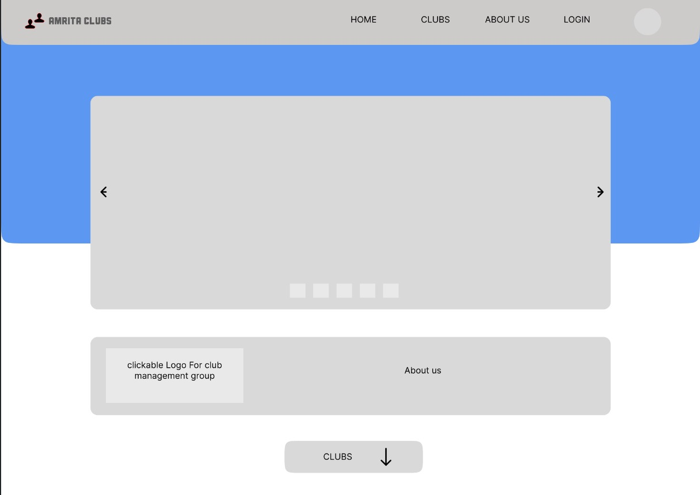
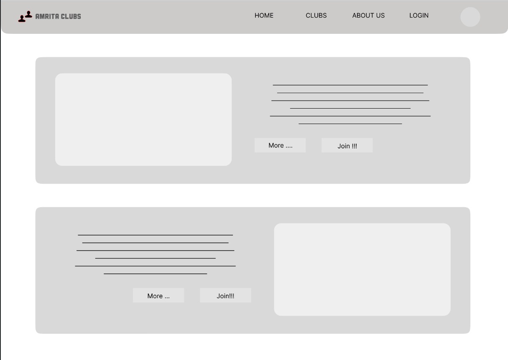
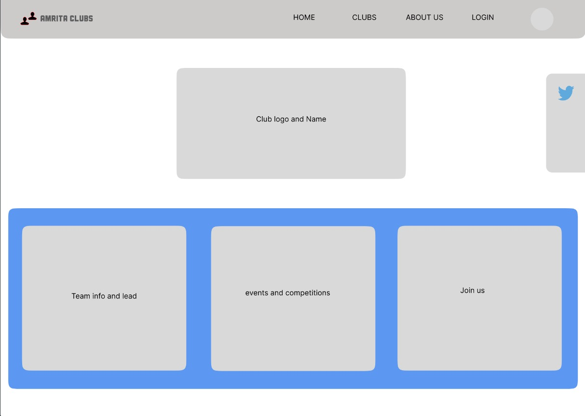
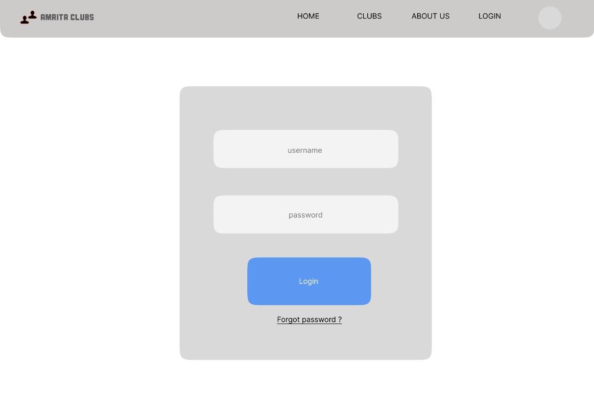

<h1>USER INTERFACE DESIGN</h1>

<h2>PROJECT NAME: Student Club Management Portal</h2>

</h3>AIM:</h3>

To maximize the out-reach of the clubs and manage them in our campus by creating a club management system.

<h3>USER ANALYSIS:</h3>

Who's the target of the website?

Students are the main users of this website.

What do they intend to see from a portal like this?

Information regarding all the clubs in the campus.

What users actually do within the site or app?

The main purpose of the website is that end user should get to know about all the clubs in the college and it provide an easy way to enrol in the clubs.

<h3>SYSTEM PROTOTYPE:</h3>

<h3>DESCRIPTION:</h3>

The home page has a navigation bar on the top with a common logo for all the clubs on the left corner and it also contains a few tabs(Home, Clubs, About Us, Login) on the right corner. In the centre of the page, we have image slider which displays the pictures of the recent events took place in the clubs. Below the image slider there is link which shows all the information about the group who maintains the website.

The club button at the bottom of the home page will scroll down to the club page. In the club page, the logo of the club will be displayed along with some description and a link to join the club. The more button in the club page will open a page for that particular club. In that page, name and logo of the club will be displayed in the centre of the page below the navigation bar.

Below the club's name and logo, there is link to read more about the club team in the bottom-left corner. Next to that is the link to know about the upcoming events and competitions in the club. Finally, we have the link to join the club in the bottom-right corner. The join us button will take you to a new page where as per the club requirements there will form with necessary details to fill.

To view your profile, you must be logged in. Use your CMS credentials to login. The profile button will be once you're logged in and can be used to view all the user's past activities and achievements.

<h4>TEAM – 15</h4>

<h4>Suganth Sarvesh S – CB.EN.U4CYS21076</h4>

<h4>Gokul - CB.EN.U4CYS21018</h4>

<h4>G R Nitin - CB.EN.U4CYS21017</h4>
